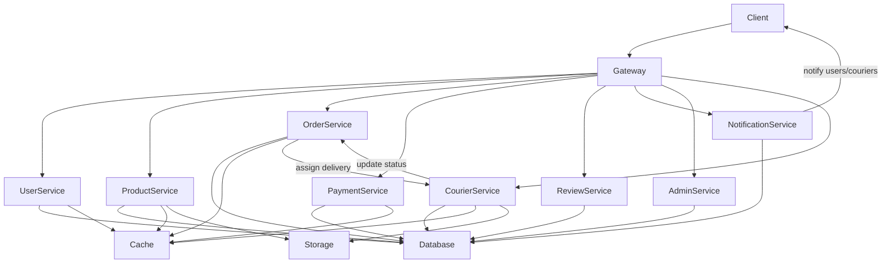

# Phase 2.1 – Microservices Architecture Diagram

## Overview
This document outlines the initial architecture diagram for the multi-vendor e-commerce platform, showing the main microservices, their responsibilities, and their interactions.

## Microservices List
- User Service (buyers, sellers, admins, couriers)
- Product Service
- Order Service
- Payment Service
- Review & Rating Service
- Notification Service
- Admin Service
- Courier/Delivery Service
- API Gateway
- Database(s), Cache, Object Storage

## Architecture Diagram (Mermaid.js)

**Legend:**
- All external clients interact via the API Gateway.
- Each service is a containerized microservice (Docker, Kubernetes).
- Services communicate via REST/gRPC; Notification Service may use async messaging.
- Database, Redis (cache), and MinIO (object storage) are shared resources.
- Courier/Delivery Service interacts with Order Service for delivery assignments and status.
- Notification Service sends updates to users and couriers.

## Next Steps
- Create a visual diagram (draw.io, Lucidchart, or Mermaid.js) for documentation.
- Detail communication patterns and data flow in Phase 2.2 and 2.3.

> Revise this diagram as your system evolves and new services or integrations are added.
